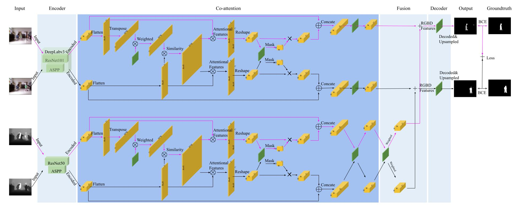

An implementation for COMP589: Unsupervised RGBD Video Object Segmentation With Co-attention Siamese Networks.

#### Network Architecture 



#### Requirements
| Library       | Version       |
| ------------- |:-------------:|
| python        | 3.7           |
| pytorch       | 1.9.0         |
| opencv        | 3.4.2         |
| numpy         | 1.20          |
| pyyaml        | 5.4.1         |
| scipy         | 1.7.1         |
| mattplotlib   | 3.4.2         |
| h5py          | 2.8.0         |
| torchsummary  | 1.4.5         |

#### Dataset
1. Create a folder for storing datasets. Download the SBM-RGBD dataset to this folder.
```
    wget https://rgbd2017.na.icar.cnr.it/SBM-RGBDdataset/IlluminationChanges/IlluminationChanges.zip
    wget https://rgbd2017.na.icar.cnr.it/SBM-RGBDdataset/ColorCamouflage/ColorCamouflage.zip
    wget https://rgbd2017.na.icar.cnr.it/SBM-RGBDdataset/DepthCamouflage/DepthCamouflage.zip
    wget https://rgbd2017.na.icar.cnr.it/SBM-RGBDdataset/IntermittentMotion/IntermittentMotion.zip
    wget https://rgbd2017.na.icar.cnr.it/SBM-RGBDdataset/OutOfRange/OutOfRange.zip
    wget https://rgbd2017.na.icar.cnr.it/SBM-RGBDdataset/Shadows/Shadows.zip
    wget https://rgbd2017.na.icar.cnr.it/SBM-RGBDdataset/Bootstrapping/Bootstrapping.zip
```

2. Unzip the downloaded zip files to a folder and arrange the files by following the structure described in [dataset_info/sbm-rgbd-file-list.txt](). Then unzip [dataset_info/ROIs.zip]() to the corresponding folders in the dataset.

3. Search all `data_path` under `sbmrgbd` in [config.yaml]() and replace their values with the path to the dataset folder from step 1.

#### Testing

1. Install libraries/frameworks from the list of the `Requirements` section.

2. Prepare the dataset by following descriptions in `Dataset` section.

3. Download the pretrained model file from [Google Drive](https://drive.google.com/file/d/1d7hpX_w9bQCpn-w1hBH89DsNw1pE5N0x). And change the value of `test`/`model`/`resnet_aspp_add`/`pretrained_params` in [config.yaml]() to the path to the model file.

4. Run `python test.py --dataset sbmrgbd --model raa --gpus X[,Y]`. `X`, `Y` are the GPU number of your graphics card. For example, `python test.py --dataset sbmrgbd --model raa --gpus 0,1`.

#### Training

1. Install libraries/frameworks from the list of the `Requirements` section.

2. Prepare the dataset by following descriptions in `Dataset` section.

3. Download the pretrained model file from . And change the value of `train`/`model`/`resnet_aspp_add`/`initial_params` in [config.yaml]() to the path to this model file.

4. Run command: `python train.py --dataset sbmrgbd --model raa --gpus X[,Y]` `X`, `Y` are the GPU number of your graphics card. For example, `python train.py --dataset sbmrgbd --model raa --gpus 0,1`.

Note: Change the value of `sbmrgbd`/`subset` for training or testing from different subsets.
